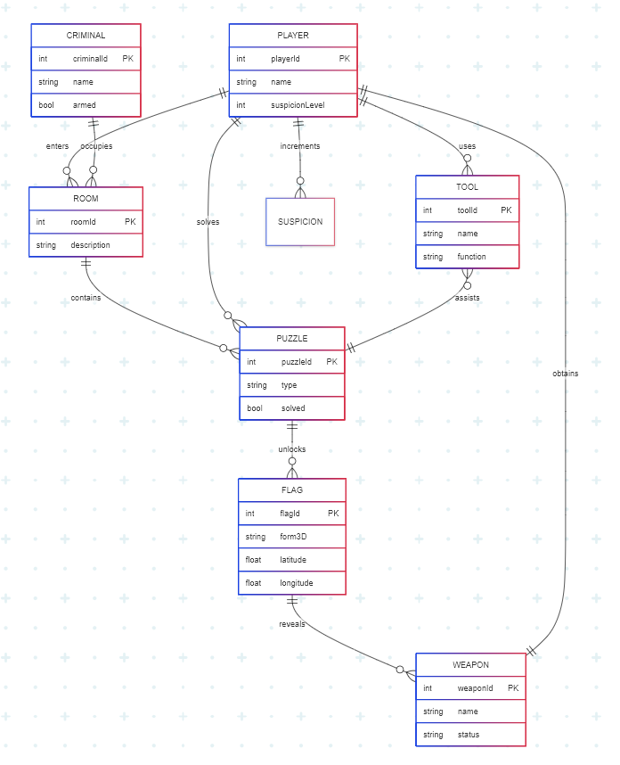
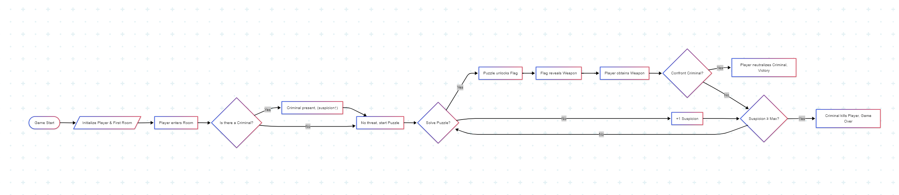
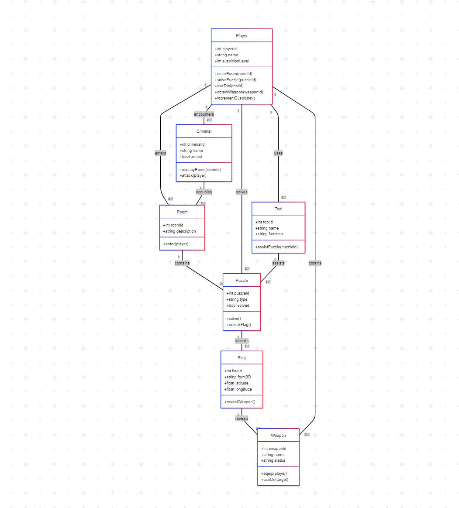

# CaptureTheGun: Re:Load

## Overview
CaptureTheGun is a single-player 3D puzzle game inspired by the psychological tension and time-loop mechanics of *Re:Zero* and the anime aesthetic of *MiSide*. Players take on the role of a detective trapped in a room with a dangerous childhood friend, now a criminal. The game features CTF (Capture The Flag) style puzzles, deep lore, and a unique blend of suspense and strategy.

### Key Inspirations
- **Re:Zero**: Time-loop mechanic—when the player dies, they return to a previous checkpoint, retaining knowledge but not progress.
- **MiSide**: Anime-inspired visuals and atmosphere, with a focus on psychological tension and character-driven narrative.

## Unique Mechanics

### Time Loop & Death Consequences
- **5 Seconds Before Death**: Each time the MC (main character) dies, they relive the last 5 seconds before death, then return to a checkpoint.
- **Sanity Parameter**: Every death increases the MC's insanity. On every 5th death, there's a 75% chance the MC will commit suicide, resulting in a unique game over and narrative consequences.
- **Memory Retention**: The MC remembers clues and puzzle solutions from previous loops, allowing for meta-progression.

### Suspicion System
- **Criminal Childhood Friend**: The main antagonist is the MC's childhood friend, now a criminal, who closely observes the player's actions.
- **Suspicion Meter**: Using tools or taking too long to solve puzzles increases the criminal's suspicion. If suspicion gets too high, the criminal may attack or sabotage the MC.
- **Stealth Puzzle Solving**: Players must balance solving puzzles efficiently while avoiding actions that raise suspicion.

### CTF-Style Puzzles
- **Puzzle Variety**: Includes cryptographic challenges, hidden clues, environmental puzzles, and more, inspired by CTF competitions.
- **Tool Usage**: Tools are hidden throughout the environment and must be used carefully to avoid detection.

## Gameplay Features

- **Third-person exploration**: Navigate detailed, anime-inspired environments.
- **Deep Lore**: Uncover the backstory of the MC, the criminal, and the mysterious circumstances trapping them together.
- **Multiple Endings**: Outcomes depend on sanity, suspicion, and puzzle-solving efficiency.
- **Meta-progression**: Use knowledge from previous loops to solve puzzles faster and unlock new narrative paths.

## System's Architecture Diagram
### Entity Relationship Diagram


### System Flow Chart


### UML Class Diagram


## Game Objectives
1. Solve interconnected CTF-style puzzles to locate the hidden gun.
2. Manage the MC's sanity and avoid repeated deaths.
3. Keep the criminal's suspicion low to survive.
4. Use environmental tools and clues wisely.
5. Discover the truth behind the time loop and the criminal's motives.

## Game Environment
The game is set in a richly detailed indoor environment with interactive objects, hidden clues, and red herrings. Every object could be a clue, a tool, or a trap.

## Project Structure

```
Assets/
├── Scenes/         - Game scenes including levels, main menu, etc.
├── Artworks/       - Visual assets, textures, and anime-inspired elements
├── TextMesh Pro/   - Text rendering and UI font system
├── Prefabs/        - Reusable game objects and components
├── Model/          - 3D models for characters, environments, and props
└── Utils/          - Utility scripts and helper functions
```

## Development Status

## Team

| Member   | GitHub |
|----------|--------|
| coolcmyk | [](https://github.com/coolcmyk) |

<div align="center">
  <a href="https://github.com/coolcmyk">
    
    
  </a>
</div>

## Screenshots
*[Screenshots will be added here when available]*

---

*CaptureTheGun* combines time-loop suspense, CTF puzzle-solving, and anime-inspired psychological drama. Every death, every clue, and every suspicious glance brings you closer to the truth—or to your own unraveling.